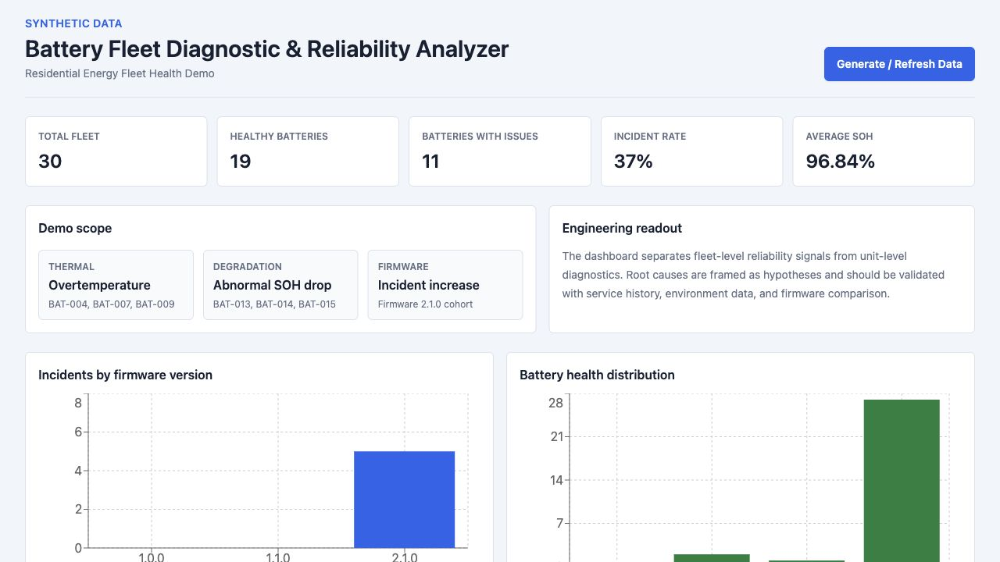
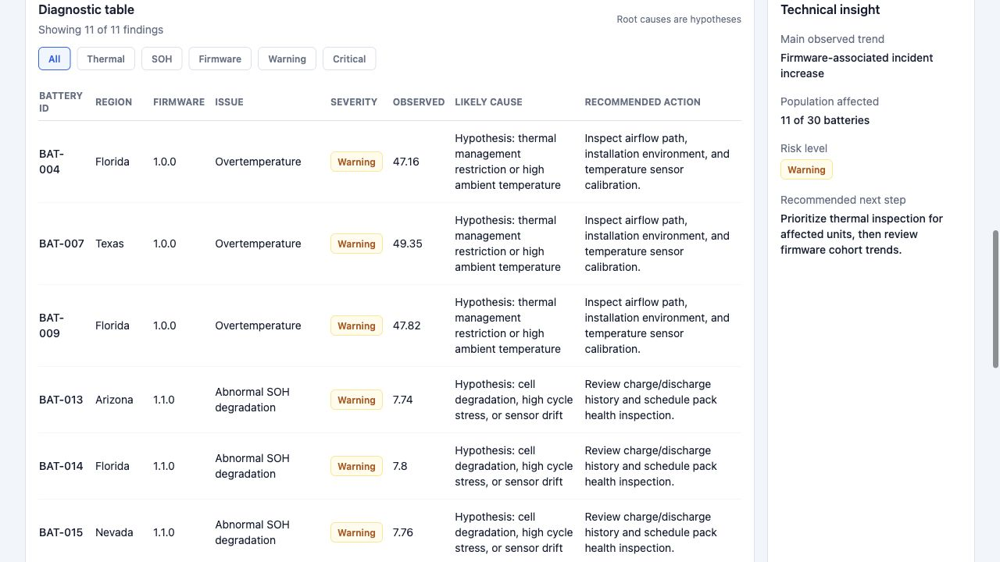
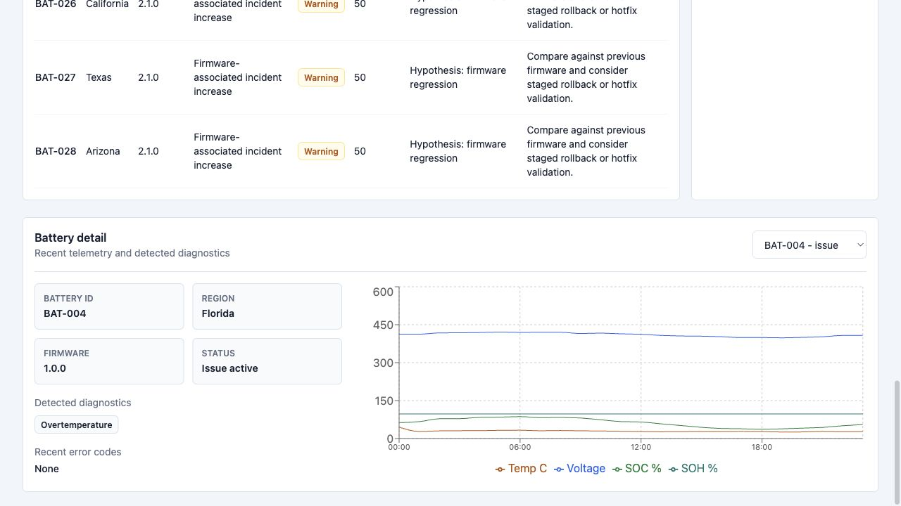

# Battery Fleet Diagnostic & Reliability Analyzer

An interview-ready full-stack engineering portfolio demo for residential battery fleet health, diagnostics, SQL, Python reliability analysis, and technical reporting.

All telemetry is synthetic. This project does not use Tesla logos, trademarks, proprietary product images, customer data, or real fleet data.



## Why This Project Exists

Residential battery systems generate large volumes of telemetry. A Systems Engineer needs to turn that telemetry into practical decisions:

- Which batteries are healthy?
- Which units show abnormal behavior?
- Is an issue isolated or fleet-wide?
- Did a firmware version introduce reliability risk?
- What is the likely engineering hypothesis?
- What action should be taken next?

This project demonstrates that workflow in a compact, explainable demo.

## Demo Highlights

- Synthetic telemetry for 30 residential batteries
- SQLite database locally, with PostgreSQL readiness through `DATABASE_URL`
- FastAPI backend using SQLAlchemy 2.x
- Pandas and NumPy analysis with transparent rules
- Next.js TypeScript dashboard
- Tailwind CSS styling
- Recharts visualizations
- Diagnostic table with severity badges and filters
- Battery-level telemetry detail
- Vercel-ready monorepo structure

## Demo Scenarios

The synthetic fleet injects exactly three visible issue patterns:

1. **Overtemperature** affecting selected batteries
2. **Abnormal state-of-health degradation**
3. **Increased failure rate associated with firmware `2.1.0`**

Root causes are presented as hypotheses, not proven conclusions.



## Current Demo Output

Typical generated dataset:

```text
Total fleet:              30 batteries
Healthy batteries:        19
Batteries with issues:    11
Incident rate:            37%
Average SOH:              ~96.84%
Firmware issue cohort:    2.1.0
```

Diagnostic findings:

```text
3 overtemperature batteries
3 abnormal SOH degradation batteries
5 firmware-related incident batteries
```

## Architecture

```text
frontend/
  Next.js + TypeScript + Tailwind + Recharts
        |
        | NEXT_PUBLIC_API_URL
        v
backend/
  FastAPI + SQLAlchemy
        |
        | DATABASE_URL
        v
SQLite locally / PostgreSQL-ready
        |
        v
Pandas + NumPy analysis
```

## Repository Structure

```text
/
├── backend/
│   ├── app/
│   │   ├── analysis.py
│   │   ├── database.py
│   │   ├── demo_data.py
│   │   ├── main.py
│   │   ├── models.py
│   │   └── schemas.py
│   └── index.py
├── frontend/
│   ├── app/
│   ├── components/
│   ├── lib/
│   ├── package.json
│   └── .env.example
├── docs/
│   ├── interview_talking_points.md
│   ├── technical_notes.md
│   └── screenshots/
├── tests/
├── requirements.txt
├── vercel.json
└── README.md
```

## Local Setup On macOS

From the repository root:

```bash
cd "/Users/pepegarcia/Documents/Tesla Deviaton Demo"
python3 -m venv .venv
source .venv/bin/activate
pip install -r requirements.txt
```

Install frontend dependencies:

```bash
cd frontend
npm install
```

If `npm` is not installed globally, this project also supports the local Node binary installed under `.tools/node`:

```bash
PATH="/Users/pepegarcia/Documents/Tesla Deviaton Demo/.tools/node/bin:$PATH" npm install
```

## Run Locally

Terminal 1, backend:

```bash
cd "/Users/pepegarcia/Documents/Tesla Deviaton Demo"
source .venv/bin/activate
uvicorn backend.app.main:app --host 127.0.0.1 --port 8001
```

Terminal 2, frontend:

```bash
cd "/Users/pepegarcia/Documents/Tesla Deviaton Demo/frontend"
npm run dev -- --hostname 127.0.0.1 --port 3000
```

Open:

```text
http://127.0.0.1:3000
```

Generate or refresh the synthetic dataset from the dashboard button, or with:

```bash
curl -X POST http://127.0.0.1:8001/demo/generate
```

## Environment Variables

Backend:

```text
DATABASE_URL=sqlite:///./battery_fleet.db
FRONTEND_URL=http://localhost:3000
```

Frontend:

```text
NEXT_PUBLIC_API_URL=http://127.0.0.1:8001
```

When `DATABASE_URL` is not set, the backend uses local SQLite. For production PostgreSQL, set `DATABASE_URL` in the deployment environment. Do not hardcode credentials.

## API Endpoints

Existing foundation endpoints:

```text
GET  /health
GET  /batteries
POST /batteries
GET  /telemetry
POST /telemetry
```

Dashboard endpoints:

```text
POST /demo/generate
GET  /dashboard/summary
GET  /dashboard/firmware-incidents
GET  /dashboard/battery-health
GET  /diagnostics
GET  /batteries/{battery_id}
GET  /batteries/{battery_id}/telemetry
```

For Vercel rewrites, the backend also accepts the same API routes under `/api/...`.

## Testing

Backend tests:

```bash
source .venv/bin/activate
pytest
```

Frontend production build:

```bash
cd frontend
npm run build
```

Verified locally:

```text
Backend tests: 6 passed
Frontend build: compiled successfully
```

## What This Demonstrates

**SQL**

Models fleet telemetry, battery metadata, firmware versions, diagnostics, reliability snapshots, and corrective action entities.

**Python**

Implements API routes, database access, synthetic data generation, and analysis services.

**Pandas and NumPy**

Convert telemetry records into fleet KPIs, firmware incident rates, battery health distributions, and diagnostic findings.

**Reliability Engineering**

Compares firmware cohorts, calculates incident rates, identifies affected population, and separates unit-level issues from cohort-level trends.

**Diagnostics**

Turns raw telemetry symptoms into severity-tagged engineering findings with expected ranges, observed values, hypotheses, and recommended actions.

**Technical Communication**

The dashboard is designed to support an interview walkthrough: overview KPIs, visual trend detection, diagnostic table, technical insight panel, and battery-level detail.



## Vercel Readiness

This repository includes:

- `vercel.json`
- FastAPI entry point at `backend/index.py`
- Next.js frontend under `frontend/`
- Python dependencies in `requirements.txt`
- frontend dependencies in `frontend/package.json`
- `.env.example` files
- CORS configuration for local frontend and deployed Vercel preview URLs

Suggested Vercel environment variables:

```text
DATABASE_URL=<postgresql connection string>
FRONTEND_URL=<deployed frontend URL>
NEXT_PUBLIC_API_URL=<deployed backend API URL or /api when deployed together>
```

Do not deploy, connect GitHub, or create cloud database resources until you are ready.

## Interview Prep

Use these files before presenting the project:

- [Interview Talking Points](docs/interview_talking_points.md)
- [Technical Notes](docs/technical_notes.md)
